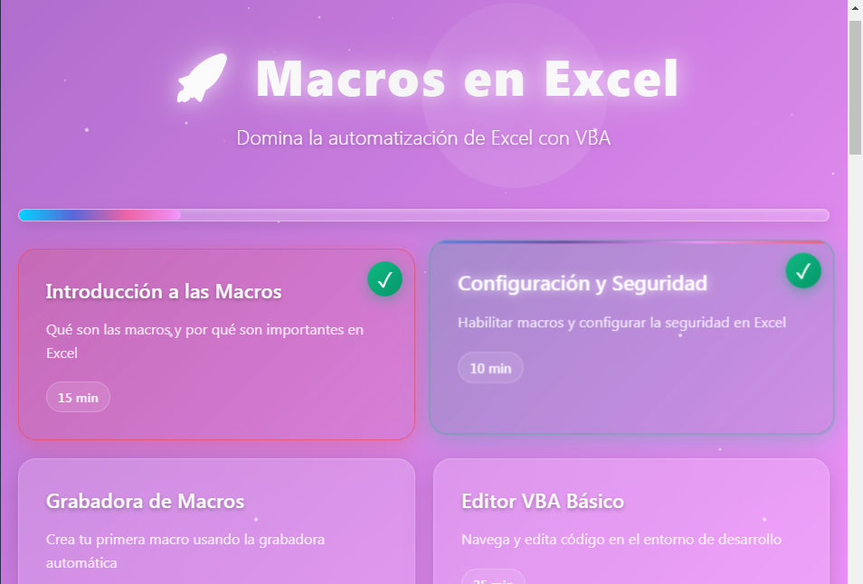
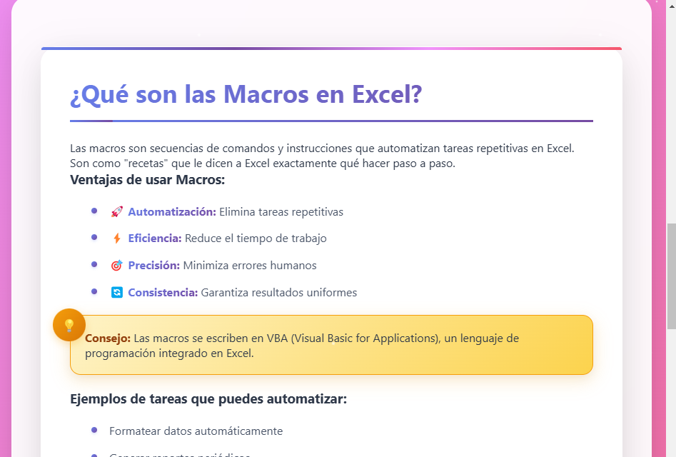
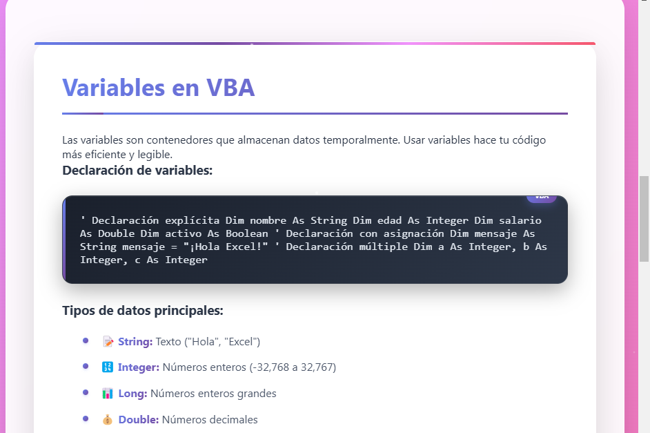

# 🚀 Tutorial Interactivo: Macros en Excel

[](https://developer.mozilla.org/es/docs/Web/HTML)
[](https://developer.mozilla.org/es/docs/Web/CSS)
[](https://developer.mozilla.org/es/docs/Web/JavaScript)
[](https://docs.microsoft.com/es-es/office/vba/api/overview/excel)

Un tutorial web interactivo y completamente funcional para aprender **Macros en Excel con VBA** desde cero hasta nivel avanzado. Diseñado con una interfaz moderna y atractiva que mantiene el compromiso del estudiante durante todo el proceso de aprendizaje.

## 🎯 Características Principales

### 📚 Contenido Educativo Completo

- **10 lecciones progresivas** estructuradas pedagógicamente
- **Ejemplos de código VBA real** y funcional
- **Ejercicios interactivos** con validación automática
- **Quizzes** para evaluar comprensión
- **Proyecto final** que integra todos los conceptos

### 🎨 Interfaz Moderna y Atractiva

- **Diseño responsive** que funciona en todos los dispositivos
- **Gradientes dinámicos** con efectos visuales suaves
- **Partículas flotantes** y animaciones CSS3
- **Efectos de celebración** al completar lecciones
- **Transiciones fluidas** entre secciones

### 🛠️ Funcionalidades Avanzadas

- **Progreso persistente** (se guarda automáticamente)
- **Navegación intuitiva** entre lecciones
- **Validación de ejercicios** en tiempo real
- **Retroalimentación inmediata** con mensajes contextuales
- **Código resaltado** con sintaxis específica para VBA

## 📖 Contenido del Tutorial

### 🎓 Lecciones Incluidas

| Lección | Tema | Duración | Descripción |
|---------|------|----------|-------------|
| **1** | Introducción a las Macros | 15 min | Conceptos básicos y ventajas de automatización |
| **2** | Configuración y Seguridad | 10 min | Habilitación de macros y configuración de Excel |
| **3** | Grabadora de Macros | 20 min | Creación de primera macro usando grabadora |
| **4** | Editor VBA Básico | 25 min | Navegación y edición en el entorno VBA |
| **5** | Variables y Tipos de Datos | 30 min | Declaración y uso de variables en VBA |
| **6** | Estructuras de Control | 35 min | Condicionales, bucles y lógica de programación |
| **7** | Trabajando con Rangos | 40 min | Manipulación de celdas y rangos de Excel |
| **8** | Funciones Personalizadas | 30 min | Creación de UDF (User Defined Functions) |
| **9** | Manejo de Errores | 25 min | Prevención y manejo de errores en macros |
| **10** | Proyecto Final | 45 min | Sistema completo de reportes automatizados |

### 🎯 Objetivos de Aprendizaje

Al completar este tutorial, los estudiantes podrán:

- ✅ **Automatizar tareas repetitivas** en Excel usando macros
- ✅ **Escribir código VBA** desde cero con buenas prácticas
- ✅ **Crear funciones personalizadas** para Excel
- ✅ **Manejar errores** y depurar código efectivamente
- ✅ **Desarrollar sistemas completos** de automatización
- ✅ **Aplicar conocimientos** en proyectos reales del trabajo

## 🚀 Instalación y Uso

### Requisitos Previos

- **Navegador web moderno** (Chrome, Firefox, Safari, Edge)
- **Microsoft Excel** (para practicar los ejemplos)
- **Conocimientos básicos** de Excel (recomendado)

### Instalación

1. **Descarga el archivo**

   ```bash
   # Clona el repositorio o descarga directamente
   git clone [URL-del-repositorio]
   ```

2. **Abre el tutorial**

   ```bash
   # Simplemente abre el archivo en tu navegador
   open excel-macros-tutorial.html
   ```

3. **¡Comienza a aprender!**
   - El tutorial funciona completamente offline
   - Tu progreso se guarda automáticamente
   - Puedes pausar y continuar cuando quieras

### Uso del Tutorial

1. **Navega por las lecciones** usando la interfaz interactiva
2. **Completa los ejercicios** en cada sección
3. **Practica el código** en Excel paralelamente
4. **Responde los quizzes** para verificar tu comprensión
5. **Desarrolla el proyecto final** para consolidar conocimientos

## 🛠️ Tecnologías Utilizadas

### Frontend

- **HTML5**: Estructura semántica y accesible
- **CSS3**: Estilos modernos con gradientes y animaciones
- **JavaScript ES6+**: Lógica interactiva y manejo de estado
- **LocalStorage**: Persistencia de progreso del usuario

### Características Técnicas

- **Diseño Responsive**: Adaptable a móviles y tablets
- **Animaciones CSS**: Transiciones suaves y efectos visuales
- **Validación en tiempo real**: Feedback inmediato en ejercicios
- **Sintaxis highlighting**: Resaltado de código VBA
- **Efectos de partículas**: Animaciones de fondo dinámicas

## 🎨 Capturas de Pantalla

### Interfaz Principal



*Vista general del tutorial con su diseño moderno, gradientes dinámicos y navegación intuitiva entre lecciones.*

### Lección Interactiva



*Ejemplo de una lección con ejercicios interactivos, retroalimentación en tiempo real y contenido educativo estructurado.*

### Código VBA



*Ejemplos de código VBA con resaltado de sintaxis, explicaciones detalladas y ejercicios prácticos para reforzar el aprendizaje.*

## 🤝 Contribuciones

Las contribuciones son bienvenidas y apreciadas. Para contribuir:

1. **Fork** el repositorio
2. **Crea una rama** para tu feature (`git checkout -b feature/nueva-funcionalidad`)
3. **Commit** tus cambios (`git commit -m 'Añade nueva funcionalidad'`)
4. **Push** a la rama (`git push origin feature/nueva-funcionalidad`)
5. **Abre un Pull Request**

### Tipos de Contribuciones

- 🐛 **Reportar bugs** y errores
- 💡 **Sugerir mejoras** en el contenido
- 📚 **Agregar más ejemplos** de código
- 🎨 **Mejorar la interfaz** y experiencia de usuario
- 🌍 **Traducciones** a otros idiomas
- 📖 **Documentación** adicional

## 📜 Licencia

Este proyecto está bajo la Licencia MIT. Consulta el archivo [LICENSE](LICENSE) para más detalles.

```text
MIT License

Copyright (c) 2025 Tutorial Interactivo Macros Excel

Permission is hereby granted, free of charge, to any person obtaining a copy
of this software and associated documentation files (the "Software"), to deal
in the Software without restriction, including without limitation the rights
to use, copy, modify, merge, publish, distribute, sublicense, and/or sell
copies of the Software, and to permit persons to whom the Software is
furnished to do so, subject to the following conditions:

The above copyright notice and this permission notice shall be included in all
copies or substantial portions of the Software.
```

## 👥 Autor

### Desarrollado con ❤️ para la comunidad educativa

- 💼 **Perfil**: Especialista en automatización de Excel y VBA
- 🎓 **Experiencia**: Material educativo para postgrado UCATEC
- 🌟 **Objetivo**: Democratizar el aprendizaje de macros en Excel

## 🔮 Roadmap y Mejoras Futuras

### Versión 2.0 (Planificada)

- [ ] **Modo oscuro** para mejor experiencia nocturna
- [ ] **Más ejemplos** de código empresarial
- [ ] **Sistema de certificación** al completar el curso
- [ ] **Integración con GitHub** para ejercicios avanzados
- [ ] **Comunidad** de usuarios y foro de ayuda

### Versión 2.1 (Planificada)

- [ ] **Módulos adicionales** para Power Query y Power Pivot
- [ ] **Ejercicios colaborativos** en línea
- [ ] **API REST** para guardar progreso en la nube
- [ ] **Mobile app** complementaria

## 📊 Estadísticas del Proyecto

- **📝 Líneas de código**: ~3,000 líneas
- **🎯 Ejercicios**: 10 ejercicios interactivos
- **❓ Quizzes**: 10 preguntas de evaluación
- **⏱️ Tiempo estimado**: 4-6 horas de estudio
- **📱 Compatibilidad**: Todos los navegadores modernos

## 🆘 Soporte

¿Necesitas ayuda? Tenemos varias opciones:

1. **🐛 Issues**: Reporta problemas en GitHub Issues
2. **📧 Email**: Contacta directamente para soporte académico
3. **📚 Wiki**: Consulta la documentación extendida
4. **💬 Discusiones**: Participa en GitHub Discussions

## 🙏 Agradecimientos

- **Microsoft**: Por VBA y la plataforma Excel
- **Comunidad Open Source**: Por las herramientas y librerías
- **Estudiantes**: Por el feedback y sugerencias constantes
- **UCATEC**: Por el apoyo institucional al proyecto

---

## 🎉 Comienza tu viaje hacia la automatización de Excel

**Enlaces rápidos:**

- [🚀 Abrir Tutorial](excel-macros-tutorial.html)
- [📚 Documentación](docs/)
- [🐛 Reportar Bug](issues/)

---

> Desarrollado con ❤️ para hacer más fácil el aprendizaje de VBA
